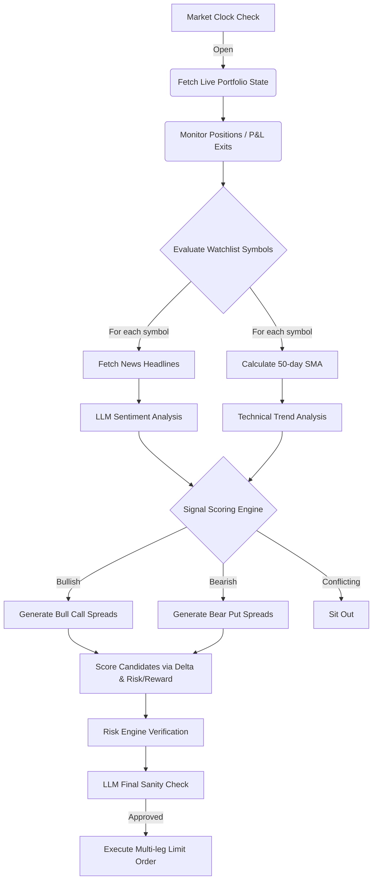

# 🤖 Autonomous Options Trading Agent

An autonomous, multi-factor AI trading agent designed to run continuously on a server. It automatically scans the market, analyzes breaking news sentiment via LLMs, calculates structural trends using moving averages, identifies high-probability options spreads, and executes trades programmatically using the Alpaca API.

## ✨ Features

- **Continuous Operation**: Designed to be deployed as a background worker. Automatically pauses operations outside of market hours and resumes when the market opens.
- **Multi-Factor Confluence**:
  - **Fundamental Edge**: Pulls the latest breaking news headlines and uses an OpenRouter LLM (e.g., Nvidia Nemotron) to gauge sentiment (BULLISH, BEARISH, NEUTRAL).
  - **Technical Edge**: Queries historical daily candles to calculate the 50-day Simple Moving Average (SMA).
  - **Scoring Engine**: Evaluates independent technical and fundamental signals, entering a trade if a directional edge exists, but explicitly sitting out if signals conflict.
- **Advanced Options Strategies**: Automatically constructs complex multi-leg trades:
  - Bull Call Spreads
  - Bear Put Spreads
- **Probability of Profit (PoP)**: Filters and scores option legs based on the Greeks (Delta), aggressively filtering out low-probability "lotto ticket" trades.
- **Risk Management Engine**: Strictly limits max risk per trade (e.g., 2% of portfolio) and max total portfolio risk, refusing trades that violate risk tolerances.
- **AI Trade Review**: Passes the final calculated trade structure to a quantitative LLM prompt for a final sanity check and reasoning breakdown before execution.
- **Idempotency**: Prevents duplicate orders by actively tracking open exposure in the portfolio.

## 🚀 Quick Start

### 1. Installation

Clone the repository and install the dependencies:
```bash
git clone https://github.com/your-username/options-agent.git
cd options-agent
python -m venv .venv
source .venv/bin/activate  # On Windows use: .venv\Scripts\activate
pip install -r requirements.txt
```

### 2. Configuration

Create a `.env` file in the root directory and add your API keys:
```env
ALPACA_API_KEY=your_alpaca_key
ALPACA_API_SECRET=your_alpaca_secret
ALPACA_DATA_URL=https://data.alpaca.markets
ALPACA_TRADING_URL=https://paper-api.alpaca.markets

OPENROUTER_API_KEY=your_openrouter_key
TRADING_ENABLED=false
```

### 3. Simulation Mode vs Live Trading

The agent features a strict killswitch via `TRADING_ENABLED`.
- When `TRADING_ENABLED=false`, the agent will run its full cycle (fetching data, scoring, AI review) but will **simulate** the final execution. This is perfect for testing.
- When `TRADING_ENABLED=true`, the agent will place live paper/real orders via Alpaca.

### 4. Running the Agent

Start the autonomous trading loop:
```bash
python -m app.agents.trading_loop
```

## 🏗️ Architecture



## ⚠️ Disclaimer

This software is for educational and hackathon purposes only. Do not use this for real-money trading without extensive forward-testing, risk management audits, and code review. Options trading carries significant financial risk.
