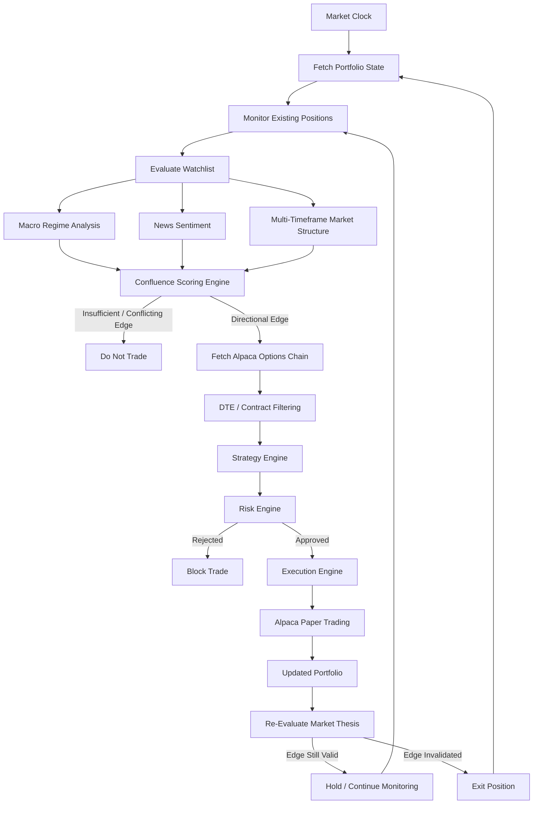

# AlphaQuant — Autonomous Multi-Factor Options Trading Agent

**AlphaQuant** is an autonomous, AI-assisted options trading agent designed to continuously observe market conditions, combine multiple independent signals into a directional thesis, apply deterministic risk controls, and execute paper trades programmatically through Alpaca.

Unlike a one-shot LLM trading bot, AlphaQuant operates as a continuous decision system:

**Observe → Analyze → Score → Select → Risk Check → Execute → Monitor → Re-evaluate**

The agent combines macro regime analysis, AI-assisted news sentiment, and multi-timeframe market structure before allowing a trade to reach the execution layer.

> **Hackathon / educational project:** AlphaQuant currently uses Alpaca paper trading and is not intended for unsupervised real-money trading.

---

## ✨ Key Features

### 🧠 Multi-Factor Confluence Engine

AlphaQuant does not allow a single signal to control execution.

For every monitored symbol, the agent independently evaluates three directional factors:

- **Macro Regime**
- **News Sentiment**
- **Multi-Timeframe Market Structure**

Each signal produces one of three states:

```text
BULLISH = +1
NEUTRAL =  0
BEARISH = -1
```

The signals are combined into a directional confluence score.

```python
macro_score = (
    1 if macro_outlook == "BULLISH"
    else -1 if macro_outlook == "BEARISH"
    else 0
)

news_score = (
    1 if news_sentiment == "BULLISH"
    else -1 if news_sentiment == "BEARISH"
    else 0
)

ict_score = (
    1 if ict_trend == "BULLISH"
    else -1 if ict_trend == "BEARISH"
    else 0
)

total_score = macro_score + news_score + ict_score
```

If the signals conflict or insufficient directional edge exists, AlphaQuant can deliberately sit out instead of forcing a trade.

---

## 🌍 Macro Regime Analysis

Options trades do not exist in isolation.

A strong company-specific setup may still fail if the broader market environment sharply changes.

AlphaQuant therefore evaluates the wider market regime before making a directional decision.

The agent retrieves relevant market and economic news through Alpaca and uses an LLM to classify the current environment as:

```text
BULLISH
BEARISH
NEUTRAL
```

This gives individual trade decisions broader market context before capital is exposed.

---

## 📰 AI-Assisted News Sentiment

AlphaQuant retrieves current headlines associated with monitored assets and uses an OpenRouter-hosted LLM to determine whether available news creates a meaningful directional bias.

The news layer returns:

```text
BULLISH
BEARISH
NEUTRAL
```

News is treated as one component of the system rather than as an automatic trading instruction.

The LLM cannot directly place an order.

Its output must pass through the confluence, strategy, portfolio, and risk layers before execution can occur.

---

## 📊 Multi-Timeframe Market Structure Analysis

The original prototype relied on simpler technical signals.

The current system instead performs top-down price-action analysis across multiple timeframes.

AlphaQuant retrieves:

* **Daily bars** for higher-timeframe directional bias
* **Hourly bars** for lower-timeframe market structure

The technical analysis layer evaluates concepts such as:

* Higher-timeframe directional bias
* Buy-side and sell-side liquidity
* Liquidity sweeps
* Market Structure Shifts (MSS)
* Fair Value Gaps (FVG)
* Alignment between higher and lower timeframes

Conceptually:

```text
Daily Bias
     ↓
Hourly Structure
     ↓
Liquidity / MSS / FVG Analysis
     ↓
BULLISH / BEARISH / NEUTRAL
```

This prevents the system from basing execution on a single candle or lagging indicator.

---

## ⏳ Expiration Risk Controls

Very short-dated options can carry extreme time sensitivity and expiration risk.

AlphaQuant therefore filters the available options chain before contract selection.

The current strategy engine excludes same-day expiration contracts and restricts candidate contracts to a configurable window.

```python
def _filter_by_dte(contracts, min_days=1, max_days=7):
    ...
```

Default candidate range:

```text
1–7 Days to Expiration
```

This removes 0DTE contracts from the strategy-selection pipeline and gives the underlying thesis additional time to develop.

---

## 🎯 Options Strategy Engine

After AlphaQuant identifies sufficient directional confluence, the options strategy layer retrieves eligible contracts from Alpaca.

Candidate contracts are filtered according to criteria such as:

* Directional bias
* Expiration date
* Contract eligibility
* Existing portfolio exposure
* Risk constraints

Only eligible candidates are passed further into the execution pipeline.

---

## 🛡️ Risk Management Engine

AlphaQuant separates market reasoning from capital allocation.

A valid directional signal does not automatically mean a trade should be placed.

Before execution, the risk layer evaluates the current portfolio and determines whether the proposed position violates configured constraints.

Risk controls include:

* Maximum risk per trade
* Portfolio exposure limits
* Existing position awareness
* Duplicate-underlying protection
* Contract eligibility
* Expiration filtering

A rejected trade never reaches Alpaca.

```text
Signal
   ↓
Strategy
   ↓
Risk Engine
   ├── REJECT → No trade
   │
   └── APPROVE → Execution
```

---

## 🔁 Continuous Thesis Re-Evaluation

Execution is not the end of the AlphaQuant workflow.

Open positions remain under active monitoring.

During subsequent trading cycles, the system recalculates the same factors that originally created the directional thesis:

```text
Macro
+
News
+
Market Structure
```

The new score is compared with the direction of existing exposure.

If the original edge becomes materially invalidated, the system can initiate an exit instead of relying exclusively on a static stop condition.

Conceptually:

```text
Open Position
     ↓
Recalculate Signals
     ↓
Original Thesis Valid?
     ├── YES → Continue monitoring
     │
     └── NO → Exit / reduce exposure
```

This creates a feedback loop rather than a one-time prediction pipeline.

---

## 🔄 Assignment-Aware Portfolio Tracking

Options positions can eventually create underlying equity exposure.

AlphaQuant normalizes both option contract symbols and equity positions back to their underlying ticker.

For example:

```text
AAPL260902C00325000
         ↓
        AAPL
```

and:

```text
AAPL shares
     ↓
    AAPL
```

The portfolio engine therefore understands that both represent exposure to the same underlying asset.

A simplified normalization step uses regular-expression parsing:

```python
underlying_match = re.match(r"^[A-Z]+", symbol)

if underlying_match:
    active_symbols.add(underlying_match.group(0))
```

This helps the agent:

* Detect existing exposure
* Prevent duplicate trades
* Recognize assigned equity positions
* Keep resulting stock exposure under portfolio monitoring

---

## ♻️ Idempotent Trade Execution

AlphaQuant actively tracks current exposure before submitting new trades.

If the portfolio already contains exposure associated with a monitored underlying, the system can block another trade instead of repeatedly submitting duplicate positions during subsequent loop iterations.

Without idempotency controls:

```text
Signal detected
→ Order
→ Loop repeats
→ Same signal
→ Another order
→ Another order
→ ...
```

With portfolio-aware execution:

```text
Signal detected
→ Existing exposure check
→ Already exposed
→ Skip duplicate trade
```

---

## 🦙 Alpaca Integration

Alpaca provides the external financial infrastructure used by AlphaQuant.

The system uses Alpaca for components including:

* Market data
* Historical bars
* Options data
* Financial news
* Market clock information
* Portfolio state
* Order submission
* Paper-trading execution

AlphaQuant separates the Alpaca integration from the higher-level decision engine so market access and strategy logic remain modular.

---

## ☁️ Continuous Cloud Deployment

AlphaQuant is designed to operate continuously on a remote server.

The deployed version runs two asynchronous workloads:

```text
AlphaQuant Process
       │
       ├── FastAPI Health Service
       │
       └── Autonomous Trading Loop
```

Both workloads run concurrently using Python's asynchronous runtime.

```python
await asyncio.gather(
    start_dummy_server(),
    loop.run()
)
```

The FastAPI service exposes an HTTP health endpoint for the hosting platform, while the autonomous trading loop continues monitoring the market in the same process.

---

# 🏗️ Architecture



---

# 🔄 Autonomous Agent Lifecycle

At a high level, AlphaQuant operates as a feedback system:

```text
Observe
   ↓
Analyze
   ↓
Score
   ↓
Select Contract
   ↓
Risk Check
   ↓
Execute
   ↓
Monitor
   ↓
Re-Evaluate
   ↓
Repeat
```

---

# 🚀 Quick Start

## 1. Clone the repository

```bash
git clone https://github.com/Ayotommy012/options-agent-hackathon.git
cd options-agent
```

---

## 2. Create a virtual environment

### Windows

```powershell
python -m venv .venv
.venv\Scripts\activate
```

### macOS / Linux

```bash
python -m venv .venv
source .venv/bin/activate
```

---

## 3. Install dependencies

```bash
pip install -r requirements.txt
```

---

## 4. Environment Configuration

Create a `.env` file in the project root.

```env
ALPACA_API_KEY=your_alpaca_key
ALPACA_API_SECRET=your_alpaca_secret

ALPACA_DATA_URL=https://data.alpaca.markets
ALPACA_TRADING_URL=https://paper-api.alpaca.markets

OPENROUTER_API_KEY=your_openrouter_key

TRADING_ENABLED=false
```

Never commit `.env` or API credentials to source control.

---

# 🧪 Simulation vs Paper Execution

AlphaQuant includes an execution kill switch through:

```env
TRADING_ENABLED=false
```

### Simulation Mode

```env
TRADING_ENABLED=false
```

The system performs the analysis pipeline but does not submit the final order.

Useful for:

* Development
* Testing
* Strategy debugging
* Demonstrations without execution

### Alpaca Paper Execution

```env
TRADING_ENABLED=true
```

Approved orders can be submitted to the configured Alpaca paper-trading account.

For hackathon and development use, the trading URL should remain:

```env
ALPACA_TRADING_URL=https://paper-api.alpaca.markets
```

---

# ▶️ Running AlphaQuant

Start the autonomous trading process:

```bash
python -m app.agents.trading_loop
```

The agent will continuously:

1. Check whether the market is open.
2. Load the current portfolio.
3. Monitor existing positions.
4. Analyze monitored assets.
5. Generate macro, news, and technical signals.
6. Calculate directional confluence.
7. Retrieve eligible options contracts.
8. Apply expiration and strategy filters.
9. Run portfolio and risk validation.
10. Execute an approved paper trade when enabled.
11. Continue monitoring the resulting position.
12. Re-evaluate whether the original market thesis remains valid.

---

# 🧰 Technology Stack

### Backend

* Python
* FastAPI
* AsyncIO

### AI

* OpenRouter
* LLM-assisted sentiment and market reasoning

### Trading Infrastructure

* Alpaca Market Data API
* Alpaca News API
* Alpaca Options Data
* Alpaca Paper Trading API

### Analysis

* Multi-factor confluence scoring
* Macro regime analysis
* Multi-timeframe price-action analysis
* Portfolio-aware risk management

### Deployment

* Render
* FastAPI health endpoint
* Concurrent autonomous trading loop

---

# 📈 Evolution of the System

AlphaQuant began as a simpler prototype:

```text
News Sentiment
      +
50-Day SMA
      ↓
Trading Signal
```

Early testing exposed several weaknesses:

* Excessive dependence on company-specific news
* Limited macro context
* Lagging technical signals
* Lack of continuous thesis validation
* Very short-dated contract exposure
* Limited awareness of changing portfolio state

The architecture was subsequently redesigned into:

```text
Macro Regime
     +
News Sentiment
     +
Multi-Timeframe Structure
          ↓
   Confluence Engine
          ↓
    Strategy Engine
          ↓
      Risk Engine
          ↓
 Alpaca Execution
          ↓
 Portfolio Monitoring
          ↓
 Continuous Re-Evaluation
```

The redesign shifts AlphaQuant from a simple signal generator toward an autonomous decision-and-risk-management system.

---

# ⚠️ Disclaimer

AlphaQuant is an educational and hackathon project.

It is currently designed around simulated and Alpaca paper-trading environments.

Nothing in this repository constitutes financial advice.

Options are complex financial instruments and can result in substantial losses.

Do not deploy this software with real capital without extensive testing, independent code review, security auditing, strategy validation, monitoring, and appropriate financial risk controls.
